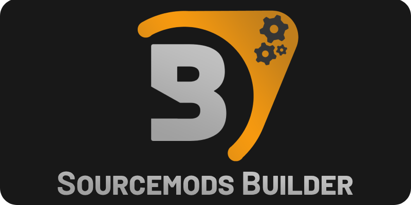
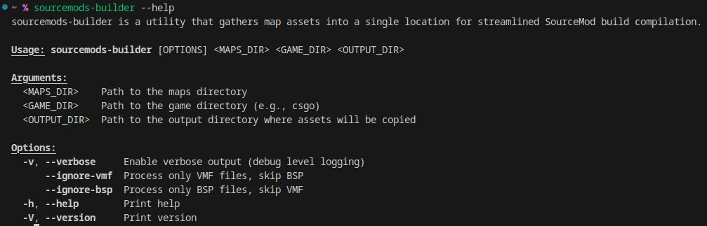
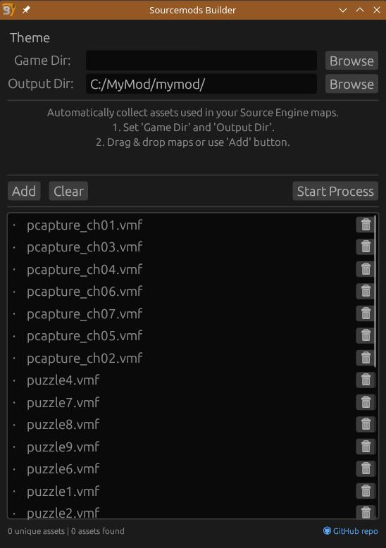

<div align="center">


<h2 align="center">
    <i>Speed up your Source Engine mod builds by automatically gathering map assets</i>
</h2>
</div>

Sourcemod Builder is a utility designed to drastically simplify the process of building and distributing Source Engine mods. It automates the collection of all essential assets (models, materials, sounds, etc.) required for your maps, processing multiple maps at once to ensure a complete and accurate asset set.  Ideal for mod developers, workshop contributors, and anyone streamlining their Source Engine content creation pipeline.

## Installation

You can install Sourcemod Builder in several ways:

**1. Download from GitHub Releases (Recommended):**

*   Pre-built binaries for the CLI (`sourcemods-builder`) and GUI (`sourcemods-builder-gui`) versions are available in the [Releases](https://github.com/IaVashik/Sourcemods-Builder/releases) section of this GitHub repository. Download the appropriate version for your operating system.

**2. Build from Source:**

*   Clone this repository:

```bash
git clone https://github.com/IaVashik/Sourcemods-Builder
cd sourcemods-builder
```

*   **For CLI version (`sourcemods-builder`):**

```bash
cargo build --release
```
The executable will be located in `target/release/sourcemods-builder`.

*   **For GUI version (`sourcemods-builder-gui`):**

```bash
cargo build --package gui --release
```
The executable will be located in `target/release/sourcemod-builder-gui`.

## Usage

**Command-Line Interface (CLI - `sourcemods-builder`):**

1.  Open your terminal or command prompt.
2.  Run the `sourcemods-builder` executable with the map directory, game directory, and output directory as arguments:

```bash
sourcemods-builder <MAPS_DIR> <GAME_DIR> <OUTPUT_DIR>
```

*   `<MAPS_DIR>`: Path to the directory containing your map files (`.vmf` or `.bsp`).
*   `<GAME_DIR>`: Path to the root directory of your Source Engine game installation (e.g., `csgo`).
*   `<OUTPUT_DIR>`: Path to the directory where you want to save the collected assets.

Example:

```bash
sourcemods-builder my_maps/ csgo/ output_assets/
```

For more options and verbose output, use:

```bash
sourcemods-builder --help
sourcemods-builder --verbose <MAPS_DIR> <GAME_DIR> <OUTPUT_DIR>
```



---

**Graphical User Interface (GUI - `sourcemods-builder-gui`):**

1.  Run the `sourcemods-builder-gui` executable.
2.  In the application window:
    *   Set the "Game Dir" and "Output Dir" by browsing to the respective directories.
    *   Drag and drop map files or folders containing maps onto the window, or use the "Add" button.
    *   Click "Start Process" to begin asset collection.
    *   Monitor the progress and find the collected assets in your specified "Output Dir".



---

## Why use Sourcemods Builder?

*   **Rapid Mod Build Assembly:**  Significantly accelerates the process of preparing your mod builds by automating asset gathering from multiple maps.
*   **Complete Asset Sets:** Ensures all necessary models, materials, and sounds are included, minimizing missing asset issues in your mod.
*   **Versatile Tooling:** Offers both a powerful CLI for automated workflows and a user-friendly GUI.

### Features

*   **Multi-Map Processing:** Handles asset extraction from multiple maps simultaneously.
*   **Comprehensive Asset Coverage:** Collects models, materials, sounds, and is designed for future expansion.
*   **Cross-Platform:** Works on Windows, Linux, and macOS.


## Contributing

Contributions are welcome! If you have suggestions, bug reports, or want to contribute code, please feel free to open issues or pull requests.

## License

Protected by the MIT license.

### *From a modder, for modders!*
